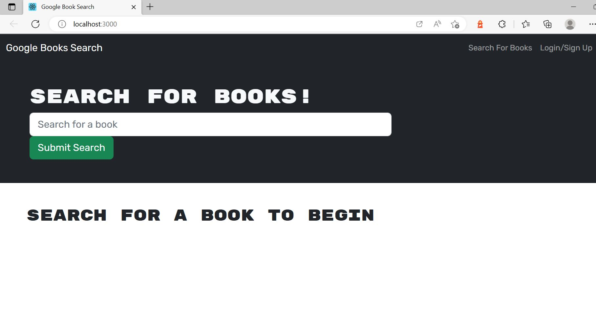

# MERN: Book Search Engine

This MERN Book search engine application is a multi page book search that allows users to search up books, view their detailed information and save them. We using MongoDB and mongoose.

## User Story

```md
AS AN avid reader
I WANT to search for new books to read
SO THAT I can keep a list of books to purchase
```

Here is the screenshot :



GitHub URL - https://github.com/Kaviambi/Book_Search_MERN.git

URL of deployed application - https://mighty-reef-16856.herokuapp.com/